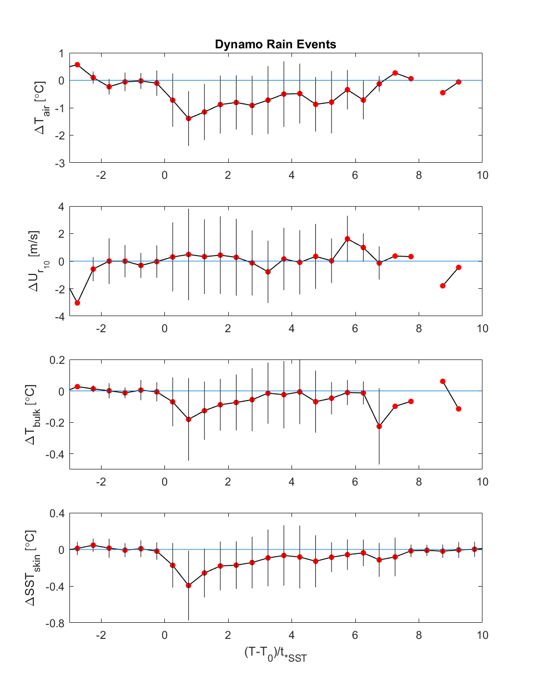

# SST-Rain-Response-Code
Code for analysis related to SST rain response paper, including updates to Deb's DYNAMO anlaysis and Falkor 2016 &amp; 2019 analysis

## Variable Names

$\Delta SST_{skin}$ - departure of skin temperature (KT15) from 3-minute mean prior to rain onset

$t_{*SST}$ - time from rain onset to maximum SST response (maximum $\Delta SST_{skin}$)

$L_{rain}$ - length of rain event

$t_{*rain}$ - time from rain onset to peak rain rate

## Overview of dataset

The figure below shows a series of histograms of relevant variables for each of the 103 identified rain events on DYNAMO.
The events are largely ~1hr long and deposit ~15mm rain, with only a few very long events (>10hrs).

## Relationships between variables

The figure below shows attempts to relate both the maximum skin temperature deviation ($\Delta SST_{skin}$) and the time between rain onset and maxiumum skin temperature deviation ($t_{*SST}$) to other relevant parameters.

The relationship between $t_{*rain}$ and $t_{*SST}$ looks fairly robust and close to 1:1 (red line). It makes some intuitive sense that the time period of the largest rain rate would tend to correspond to the time period of the largest SST deviation.

The other relationship that may have some legs is between $L_rain$ vs. $t_{*SST}$. However, this correspondence may just reflect the agreement between $t_{*rain}$ and $t_{*SST}$, in that longer rain events may tend to take longer to reach their maximum rain rate. **Plot $L_rain$ vs. $t_{*rain}$ and verify.** 

## Normalized timeseries of temperature deviation

It would seem to make more sense to **normalize the timescale in this figure by $t_{*rain}$ rather than $t_{*SST}$**, especially given the good correspondence between the two.

### Deb's scripts:
SST_rain_comparison_ID_rainpeaks.m  does the basic peak detection and collates met data from Edson.

SST_rain_comparison_bin_average_interim.m   plots some histograms and scatter
plots

SST_rain_comparison_with_anomaly.m    Collates variables into structure Var

SST_rain_comparison_peak_response.m   Adds times to max SST response, time to
recover, etc.

SST_rain_comparison_bin_average_more.m   bin averages to create composite
event - scales to beginning of event, and produces unscaled time as well (want
scaled!)

SST_rain_comparison_bin_average_long_short.m   bin averages to create
composite but selects out long events
